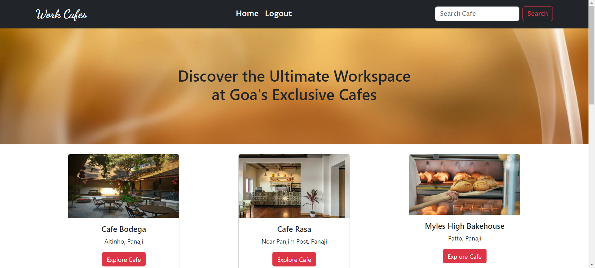
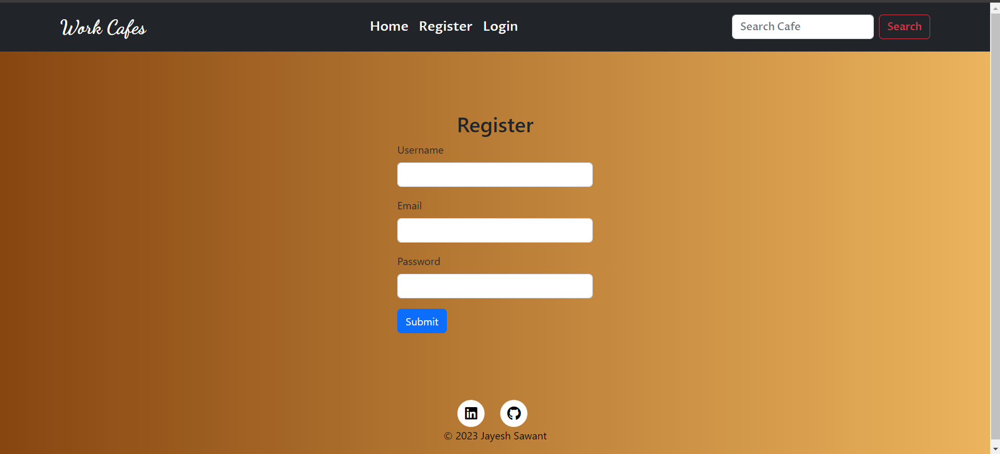
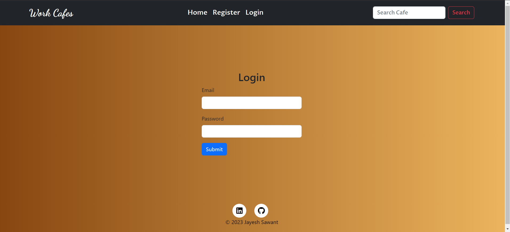
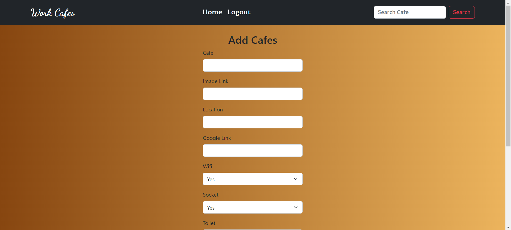
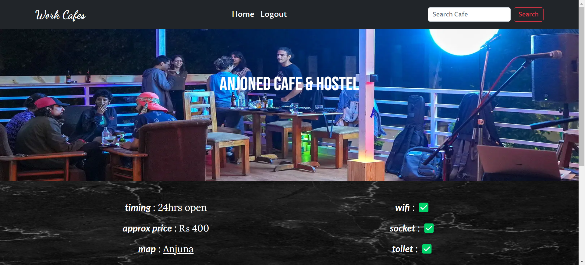
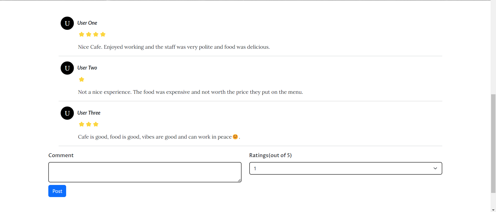

# Goa Cafe Collection For Remote Work 🏖️☕

## Overview 🌟

Welcome to the Goa Cafe Collection site! This platform is designed to help remote workers find cafes in Goa where they can work comfortably. Users can explore cafe amenities, read reviews, and leave their own feedback. If you're the site creator, you can manage cafes by adding, modifying, or deleting entries.

## Features ✨

- Responsive design with Bootstrap for a seamless experience on different devices.
- Explore Cafes: Browse through a list of cafes in Goa.
- View Details: Check out cafe amenities, location, and reviews.
- Leave Reviews: Logged-in users can leave their feedback.
- Manage Cafes: Admin can Add, modify, or delete cafes from the admin panel.
- User Authentication: Secure login and password protection.
- Database Management: Utilizes Flask Alchemy for relational databases.

## Requirements 🛠️

- Python 3.x
- Flask
- Bootstrap
- FlaskForm
- wtforms
- SQLAlchemy

## Working of Website 🌐

### Home Page 🏠

### Register Page 📝

### Login Page 🔑

### Add a Cafe Page 🏢

### Cafe Page ☕

### Comments 💬

